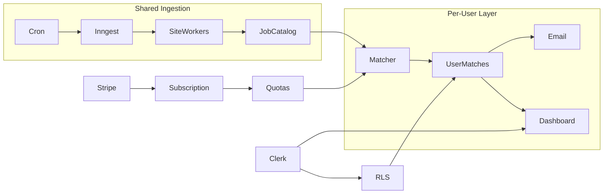
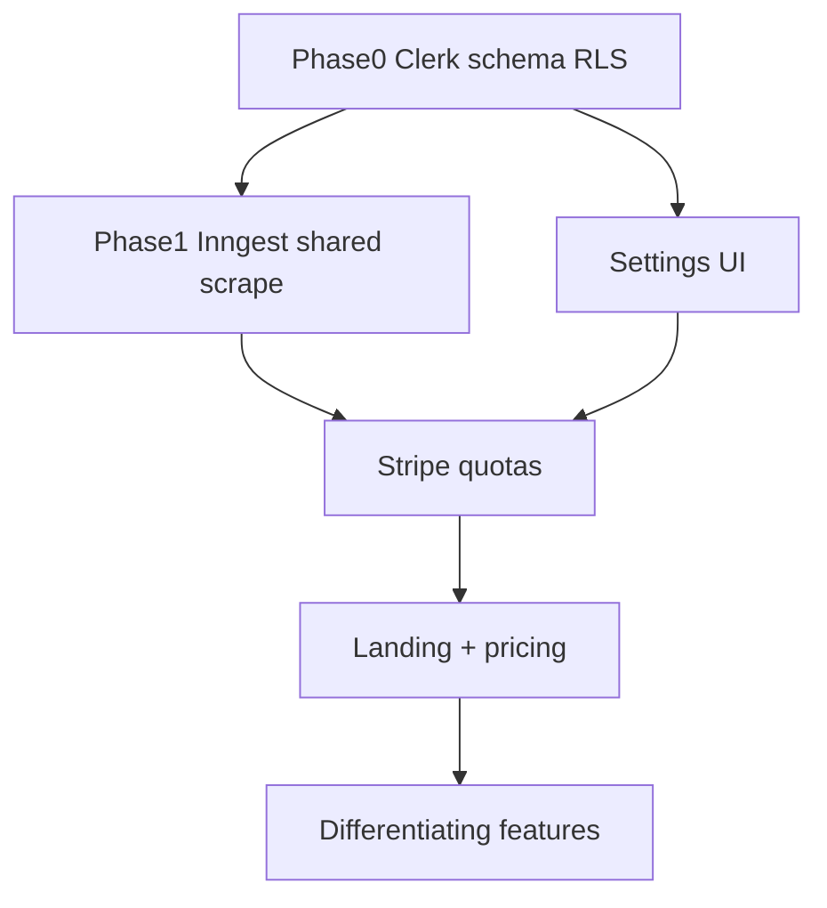

# SaaS Job Scraper Roadmap

Turn the single-user job scraper into a multi-user SaaS with Clerk auth, Postgres RLS, Stripe paywall, a marketing landing page, and a shared-pool scraper architecture — starting PH-first (OnlineJobs), then expanding to reliable global sources.

## Current gaps (what blocks SaaS today)

- **No auth** — all APIs open except cron; [`src/app/page.tsx`](../src/app/page.tsx) redirects straight to dashboard
- **Single-tenant schema** — `SearchConfig` / `UserProfile` use `id: "default"`; `Job` has no user scope ([`prisma/schema.prisma`](../prisma/schema.prisma))
- **No RLS** — even after adding `userId` filters in app code, a buggy query could leak another user’s data
- **No billing** — no Stripe, plans, or quotas
- **No landing page** — zero marketing surface
- **Scraper runs in-request** — sequential Cheerio scrapes inside Vercel cron/HTTP; only OnlineJobs enabled; LinkedIn/Indeed not SaaS-safe
- **Settings UI WIP**; email hardcoded to `NOTIFICATION_EMAIL`; no tests

## Locked decisions

| Decision | Choice |
|----------|--------|
| Auth | **Clerk** |
| Data isolation | **App-level `userId` filters + Postgres RLS policies** (defense in depth) |
| Billing | **Stripe** (Checkout + Customer Portal + webhooks) |
| AI | **DeepSeek + Mistral** (replace OpenAI) — see below |
| Scraping | **Shared pool** — scrape boards once → match per user |
| MVP market | **PH-first** (OnlineJobs + RemoteOK/Upwork RSS), then more global boards |
| Background jobs | **Inngest** (fits Next.js/Vercel; replaces in-request scrape) |

### AI providers (no OpenAI)

Replace [`src/lib/ai.ts`](../src/lib/ai.ts) OpenAI client with OpenAI-compatible SDKs pointed at each provider:

| Task | Provider | Why | Env |
|------|----------|-----|-----|
| Job relevance scoring | **DeepSeek** (`deepseek-chat`) | Cheap + fast for high-volume match fan-out | `DEEPSEEK_API_KEY` |
| Cover letters / improve | **Mistral** (`mistral-small-latest` or `mistral-large-latest`) | Strong writing quality for user-facing text | `MISTRAL_API_KEY` |

Implementation notes:

- Use the `openai` package (or fetch) with custom `baseURL`:
  - DeepSeek: `https://api.deepseek.com`
  - Mistral: `https://api.mistral.ai/v1`
- Keep the same function surface (`scoreJobRelevance`, `generateCoverLetter`, `improveCoverLetter`) so scrape/match and dashboard routes stay unchanged.
- Gate features on the relevant key (scoring needs DeepSeek; cover letters need Mistral).
- Meter cover-letter calls per plan; prefer DeepSeek for bulk scoring to control SaaS COGS.
- Drop `OPENAI_API_KEY` from `.env.example` / docs.

---

## Target architecture



**Jobs are global; matches are personal.** Catalog uniqueness stays `@@unique([site, externalId])`. Per-user state lives in `UserJob` (status, aiScore, saved, applied). RLS ensures User A cannot read/write User B’s rows even if application code forgets a `WHERE` clause.

---

## Phase 0 — Foundation (auth + tenancy + RLS)

### Clerk

1. Add **Clerk** (`@clerk/nextjs`), protect `/dashboard` and all `/api/*` except Stripe/Clerk webhooks and cron.
2. On first login: sync `User` from Clerk, create default `SearchConfig` + empty `UserProfile`.

### Schema

- `User` — `clerkId`, email, plan, stripeCustomerId
- `SearchConfig` / `UserProfile` — `userId` FK (drop `"default"`)
- `UserJob` — per-user status/score; FK to global `Job`
- `Subscription` — plan, status, periodEnd
- `GeneratedEmail` — scoped via `UserJob` / `userId`

### Row Level Security (Postgres)

Defense in depth: app code always filters by `userId`, and Postgres enforces it.

**Tables with RLS enabled (user-owned):**

| Table | Policy intent |
|-------|----------------|
| `User` | Users can `SELECT`/`UPDATE` only their own row (`clerkId` / id match) |
| `SearchConfig` | CRUD only where `user_id = current_user` |
| `UserProfile` | CRUD only where `user_id = current_user` |
| `UserJob` | CRUD only where `user_id = current_user` |
| `GeneratedEmail` | Access only rows owned by current user |
| `Subscription` | `SELECT` own row; writes via service role (Stripe webhooks) |

**Shared / system tables:**

| Table | Policy intent |
|-------|----------------|
| `Job` | Authenticated users: `SELECT` only. Inserts/updates: **service role** (Inngest scrapers) |
| `ScrapeLog` / `SiteConfig` | Service role only |

**How Prisma + Clerk set the RLS context:**

1. Store Clerk user id (or internal `User.id`) on each user-owned row as `userId`.
2. At the start of each request transaction, set a session variable:

```sql
SELECT set_config('app.current_user_id', '<userId>', true);  -- true = LOCAL to transaction
```

3. Policies use that setting, e.g.:

```sql
CREATE POLICY user_job_isolation ON "UserJob"
  FOR ALL
  USING (user_id = current_setting('app.current_user_id', true))
  WITH CHECK (user_id = current_setting('app.current_user_id', true));
```

4. Wrap DB access in a helper, e.g. `withUserRls(userId, (tx) => …)`, used by all user-facing API routes.
5. **Service role** for Inngest / cron / Stripe webhooks: separate DB user with `BYPASSRLS` (or policies that allow when `app.role = 'service'`), so matchers can insert `UserJob` rows for many users and scrapers can write the global catalog.

**SQL migrations:** keep RLS policies in `prisma/migrations` (raw SQL) or `prisma/sql/rls.sql` applied after `db push` — Prisma schema alone cannot express policies.

**Verification:** integration test that User A’s token cannot `SELECT` User B’s `UserJob` / `SearchConfig` even via raw Prisma without the correct `set_config`.

**Reuse:** filter pipeline, AI helpers, dashboard job UI.  
**Rewrite:** singleton assumptions in [`src/app/api/settings/route.ts`](../src/app/api/settings/route.ts), [`src/app/api/profile/route.ts`](../src/app/api/profile/route.ts), [`src/app/api/jobs/route.ts`](../src/app/api/jobs/route.ts).

---

## Phase 1 — Scraper revamp (shared pool + queue)

**Stop scraping inside the HTTP request as the primary path.**

1. Introduce **Inngest** functions:
   - `scrape-site` — one site per job, rate-limited (service role)
   - `match-users` — after ingest, fan-out filter + optional AI score into `UserJob` (service role)
   - `send-digests` — per-user Resend emails
2. Keep Cheerio for OnlineJobs; prefer **API/RSS** for RemoteOK + Upwork (already in repo).
3. Tier sites:
   - **Tier 1 (MVP):** onlinejobs, remoteok, upwork
   - **Tier 2:** weworkremotely, kalibrr, jobstreet (HTML, monitor health)
   - **Tier 3 (defer):** linkedin, indeed — high block/ToS risk; don’t sell as core
4. Harden scrapers: retries, empty-result alerts via `ScrapeLog`, circuit-break on repeated zero results.
5. Dashboard “Run scrape” becomes **enqueue** + status poll (keep SSE UX, back it with Inngest events).

Key files: [`src/lib/scrapers/index.ts`](../src/lib/scrapers/index.ts), [`src/app/api/cron/scrape/route.ts`](../src/app/api/cron/scrape/route.ts), [`src/lib/filters.ts`](../src/lib/filters.ts).

---

## Phase 2 — Product surface (settings + paywall)

### Settings UI (finish WIP)

- Keywords, sites, salary, notifications, AI threshold — wired to per-user `SearchConfig`
- Profile form already exists; bind to Clerk user

### Stripe paywall

| Plan | Price (suggested) | Limits |
|------|-------------------|--------|
| Free | $0 | 1 saved search, 1 site, daily digest, no AI cover letters |
| Pro | ~$12–19/mo | 5 searches, all Tier-1/2 sites, AI scoring, 20 cover letters/mo |
| Pro+ | ~$29/mo | Unlimited searches, hourly matching, 100 cover letters/mo, priority |

Gate: site count, scrape/match frequency, AI cover-letter quota. Soft-block with upgrade CTA in dashboard.

Webhook → update `User.plan` / `Subscription` (service role). Customer Portal for manage/cancel.

---

## Phase 3 — Landing page

Replace redirect in [`src/app/page.tsx`](../src/app/page.tsx) with a marketing page:

- **Hero:** product name + one headline + CTA (Start free / Sign in via Clerk)
- **How it works:** scrape once → match → alert → cover letter
- **Social proof / demo:** screenshot of dashboard job list
- **Pricing:** Free / Pro / Pro+ with Stripe Checkout links
- **Footer:** ToS, privacy (needed for Clerk + Stripe)

Design: one composition first viewport, expressive type, atmospheric background — follow existing dashboard tokens where possible; avoid generic purple-gradient AI look. Mobile-first.

Routes: `/` landing, `/dashboard` app, `/pricing` optional alias, `/sign-in` `/sign-up` Clerk hosted or embedded.

---

## Phase 4 — Differentiating features (post-MVP)

1. **Multi-search alerts** — several keyword sets
2. **Application tracker** — new → interested → applied → interview → offer
3. **AI cover letters + tone presets** — meter by plan
4. **Chrome extension / “Save job” bookmarklet**
5. **Slack/Discord webhooks**
6. **Company blocklist + salary insights**
7. **Auto-expire stale jobs**
8. **Team seats later** — skip for MVP

---

## Suggested build order



1. Clerk + lock APIs + user-scoped schema + RLS policies + `withUserRls` helper  
2. Shared catalog + `UserJob` + Inngest ingest/match (service role)  
3. Settings UI + per-user email  
4. Stripe plans + quota gates  
5. Landing page + pricing  
6. Tracker / multi-search / extension as growth features  

---

## Out of scope for first SaaS MVP

- Selling LinkedIn/Indeed scraping as a feature
- Org/team workspaces
- Mobile apps
- Browser automation farm (Playwright/Firecrawl) — only add later for Tier-2 sites that break Cheerio

---

## Success criteria

- Unauthenticated users see landing; cannot hit job APIs
- Two users get isolated matches from the same scraped job
- **RLS:** User A cannot read User B’s `UserJob` / `SearchConfig` / `UserProfile` even if app filter is omitted
- Service role can still ingest jobs and fan-out matches
- Free user blocked from Pro sites/AI with upgrade path
- Cron enqueues Inngest; OnlineJobs + RemoteOK ingest without request timeout
- Stripe test-mode checkout → plan reflected in dashboard

---

## Implementation todos

- [ ] Phase 0: Clerk auth, user-scoped schema, RLS policies + `withUserRls`, protect routes/APIs
- [ ] Phase 0b: Swap AI — DeepSeek for scoring, Mistral for cover letters (`src/lib/ai.ts`)
- [ ] Phase 1: Inngest queue, shared Job catalog, per-user match fan-out, Tier-1 sites
- [ ] Phase 2: Settings UI, Stripe plans, webhooks, quota gates
- [ ] Phase 3: Marketing landing + pricing CTAs
- [ ] Phase 4: Multi-search, application tracker, notification channels, job expiry
